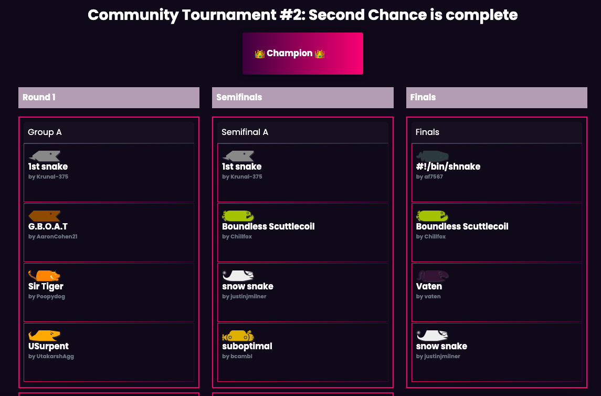
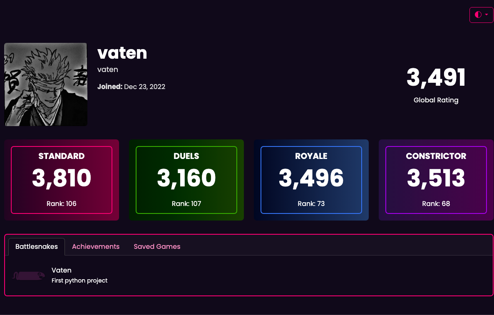

# Battlesnake Python Project

An official Battlesnake template written in Python. Battlesnake is an autonomous survival game popular among web developers. The objective is to keep the snake alive as it moves around the game board using Python 3 and Flask. Using Replit, I completed the introductory achievements to create my own battlesnake and competed in tournaments to test its capabilities against other players' battlesnakes. This project gave me a strong foundation in Python. Check out the [website](https://play.battlesnake.com) for more info.

## Technologies Used

This project uses [Python 3](https://www.python.org/) and [Flask](https://flask.palletsprojects.com/). It also comes with an optional [Dockerfile](https://docs.docker.com/engine/reference/builder/) to help with deployment.

## Tournaments (Battlesnake Community Tournament: Second Chance Bracket)

Check out this [link](https://www.youtube.com/watch?v=6T-pkF3ImsE&ab_channel=coreyja) for my tournament I join to play with other battlesnakes! I was able to get into the finals but didn't win in the end, however I learned some mistakes I found from those games that I can do better on my coding!

## Achievements

## View some of the games that I played

